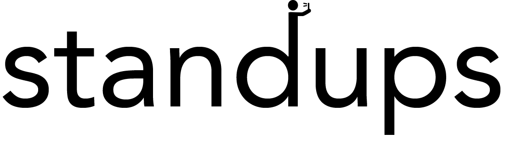

<h1 align="center">
  
</h1>
<h2 align="center">
  <h3>Video-Based Tool to facilitate Morning Scrum Standups</h3>
</h2>

**Standups** is a project developed to help facilitate remote scrum meetings (Standups) in the workplace. The project is open-source and contributions are greatly appreciated.  

## Important Notices
* The Standups project is split into two seperate repositories: Client (You are currently in) & [https://github.com/armaandh/standups-api](Server)


## Table of Contents

[**Features**](#features)

**Installation**
  * [**1 - Server Side Installation**](#server-side-installation)
  * [**2 - Client Side Installation**](#client-side-installation)
  

**Additional Info**
  * [**Changelog**](#changelog)
  * [**License**](#license)

## Client Side Installation

1. Setup all the infrastructure resources in AWS cloud environment. | Go to https://github.com/armaandh/standups-api and go through all steps
2. Go to root folder
3. Include `amazonConfig.js` file into `src/utils folder` | You have to get it after AWS setup is done
4. Install packages | >`npm install`
5. Run the project | >`npm start`


## Server Side Installation

1. This project relies on Serverless Framework & Amazon Web Services.
```
# Installing the serverless cli
npm install -g serverless
# Updating serverless from a previous version of serverless
npm install -g serverless
# Login to the serverless platform
serverless login
```
2. Run the deployment command | >`serverless deploy`


## Features
* Ability to create teams and sub-teams to organize your company departments
* Record Video using your Computers WebCam or through your phone camera. 
* View other teams Standup meeting videos


## Changelog

1.0 - Initial Release

## License

[MIT](LICENSE) © Paul Cowles, Armaan Dhanji, Edgar Zapeka, Cha Tum, Liam Macneil
